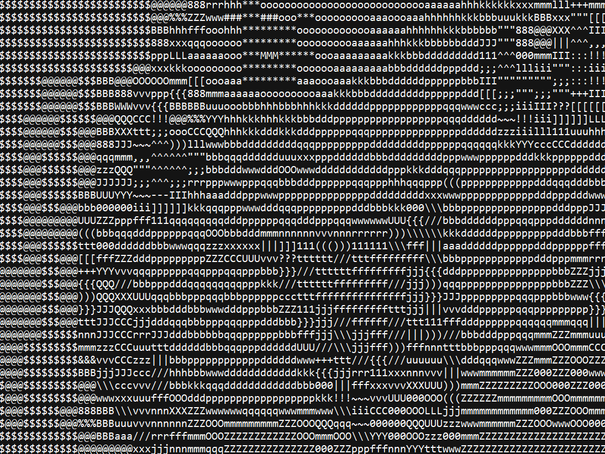

# ASCII-Art
This is one of my easy but most enjoyed projects, build your own ASCII Art using this code
ASCII art is basically an image drawing etc. made entirely of ascii characters like a,b,c,#,& etc.
In my version the code takes an image and converts it in ascii asrt

  this is a sample image I have chosen randomly

  this is the same image converted to ascii with my code, all the pixels have been changed to letters

  a zoomed in version of the ascii art, if you look well you can see that the image is composed of letters
